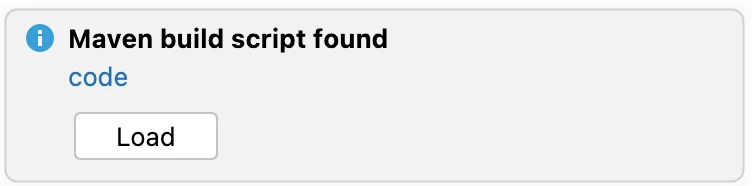
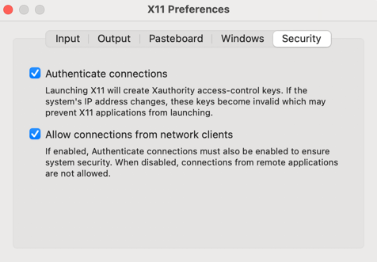

# DD Poker Developer Notes

## Introduction

Welcome to the DD Poker source code. This page tells you (hopefully)
everything you need to know to run the three main programs that
make up DD Poker:

* **DD Poker Game** - the poker game itself, a Java Swing desktop application
* **Poker Server** - the backend API server that the game talks to for online games
* **Poker Web** - the old Apache Wicket-based DD Poker website, including the "Online Game Portal", which
  shows various information about online games like current games, history, games by player, etc.

## Mac vs Linux vs Windows (a note from Doug)

These instructions are admittedly Mac centric, largely because that is what I have used
for the last 15 years.  I've done cursory testing on Linux (see Appendix D for testing tips
on Ubuntu from Docker/Mac).

Even though DD Poker was originally developed
mainly on Windows (with Cygwin), I haven't used Windows for development in a
very long time, so apologies to Windows developers for the lack of instructions.
Cygwin worked back in the day and I imagine that the Windows Subsystem for Linux (WSL)
should be helpful here, too.

Feel free to submit a PR with any changes to these docs that would help Linux or Windows users.

## Prerequisites

Required software:

* Java 11 - [See AdoptOpenJDK](https://adoptopenjdk.net/releases.html?variant=openjdk11&jvmVariant=hotspot)
* Maven 3 - [See Apache Maven](https://maven.apache.org/install.html)
* Docker (optional, but useful to run some things) - [See Docker](https://docs.docker.com/engine/install/)

Both `java` and `mvn` must be on your `PATH`.

We provide the `ddpoker.rc` file, which sets some environment variables required by the scripts in
`tools/bin` and `tools/db`, adds these script directories to the `PATH`, creates some useful
`mvn` aliases (used below) and performs some sanity checks.

**NOTE**: all commands below assume you have sourced `ddpoker.rc`, have `mvn` and `java` installed and are
in the root of the `ddpoker` repository.

```shell
source ddpoker.rc
```

## Mac Installs

[Brew](https://brew.sh/) is useful to install Java and Maven:

```shell
# Java - Intel
brew install openjdk@11

# Java - Apple Silicon (M1,M2,M3,...)
brew install temurin@11

# Maven
brew install maven
```

## Compile Code

To compile the code and create the `.jar` and `.war` files,
use maven.  This version skips the tests, which you can
run separately (see below).

```shell
mvn-package-notests
```

After you have run this, any of the scripts discussed below should just work.

## Poker Game

To run the desktop poker game, either run `PokerMain` in IntelliJ or use the script:

```shell
poker
```

If you want to run the game using your personal servers, you'll need to set go
to _Options -> Online -> Public Online Servers_ and check the **Enabled** checkbox and
enter the server information in the two fields.  See below for details on running the
servers.

If you start `poker` with `enabled=true`, but your servers are not running, you may see a
several second delay on startup as a connection attempt is made and freezes the UI until it times out.

## Development

IntelliJ can be used to run the programs described below.  If you open up the
root of this project in IntelliJ, it should auto-detect
the `code/pom.xml` file and prompt you to load it:



**NOTE**:  You will probably need to edit the Project Structure to tell IntelliJ to use Java 11.
Go to _File -> Project Structure... -> Project Settings -> Project -> SDK_ and
set to Java 11 (you may need to add it (_+ Add SDK_) as a new SDK if not already there).

## Server Dependencies

To run server code, you need to have MySql running and an SMTP server.  See the
appendices below for more details:

* `Appendix A` Setup Database via Docker
* `Appendix B` Setup Email SMTP server on Mac
* `Appendix C` Setup Database directly on a Mac

## Run Tests

To build code and run units tests, use `mvn-test`.  Some
tests assume the `pokertest` database exists.

```shell
mvn-test
```

## Poker Server

To run the DD Poker server and chat server, which is what the game talks to,
you can run `PokerServerMain` in IntelliJ or use the `pokerserver` script:

```shell
pokerserver
```

## Poker Website

To run the DD Poker website, a wicket-based app, you have two options:

The first option is to run the `PokerJetty` testing app, which
runs the webapp using Jetty.  This setup allows one to
auto-detect changes to Wicket `.html` files, so you don't
have to restart after each edit.  You can run `PokerJetty`
directly in IntelliJ, or via the `pokerweb` script:

```shell
pokerweb
```

The second option is to run using Tomcat via Docker, similar to
what a production setup might look like.

```shell
mvn-package-no-tests
docker build -f Dockerfile.pokerweb.docker -t pokerweb .
docker run -it -p 8080:8080 pokerweb

# get container id for following commands
CONTAINER=$(docker ps | grep pokerweb | cut -f 1 -d " ")

# To see logs
docker exec -it $CONTAINER tail -200f /home/ddpoker3/work/ddpoker/runtime/log/poker-web.log

# To login to running server
docker exec -it $CONTAINER bash
```

Once started, you can visit [http://localhost:8080/online](http://localhost:8080/online).

## Code Notes

This section is meant to help developers understand the code base, and it contains random
bits of knowledge and advice.

### Warning - This Code is Old!

This code base was originally written over 20 years ago, beginning in 2002.  The majority
of DD Poker was written from 2004-2007, with sporadic updates after that.  The original
JDK was 1.5.

Most of our dependencies (Swing, Hibernate, Wicket, log4j, etc.) have been updated to the latest versions
that work with Java 8 (and soon, Java 11).

That said, amazingly, it all still seems to work.  If anybody wants to start upgrading dependencies,
we are happy to take PRs.

### Modules

Here is a brief overview of the modules in this repo, in the order maven builds them, which
means the later modules are dependent on one or more of the earlier modules.

* `common` - core functionality including configuration, logging, xml, properties, various utils
* `mail` - email sending tools
* `gui` - GUI infrastructure extending Java Swing
* `installer` - custom installer logic (e.g., cleanup)
* `db` - database infrastructure extending Hibernate
* `wicket` - web infrastructure extending Java Swing
* `jsp` - tools using `.jsp` pages to generate emails and files
* `server` - core server functionality
* `udp` - core UDP networking functionality
* `gamecommon` - core game utilities shared across client and server
* `gameengine` - core game engine
* `ddpoker` - a few classes put into `com.ddpoker` package instead of `com.donohoedigital` (for reasons lost to history)
* `pokerengine` - core poker utilities shared across client and server
* `pokernetwork` - core poker networking infrastructure shared across client and server
* `poker` - DD Poker UI (aka client)
* `tools` - misc tools used for running a games business
* `gameserver` - core game server
* `pokerserver`- DD Poker backend server
* `gametools` - tools to help build games (e.g., Border and Territory mangers)
* `pokerwicket` - DD Poker website and Online Portal
* `proto` - prototype code used for experiments and proof of concept code

### Unit Tests (a note from Doug)

There is some test coverage, but it is sorely lacking in the core poker logic.  This actually
bit me once when I had to solve a multiple-split pots bug.  I didn't get religion
on good test coverage until I worked at a high-frequency trading company writing code
to trade on the US stock markets with my boss's money.

I apologize for the lack of tests.

### Properties Files

Properties files are used for two primary purposes

* `log4j2.*.properties` - `LoggingConfig` - configure logging
* `*.properties` - `PropertyConfig` - configure application behavior, various settings, localizable text

One key tenet we adhered to at Donohoe Digital was to avoid making "temporary" changes
to `.properties` files for personal use (e.g., development, debugging or testing).
Instead, settings could be overridden using user-specific files.  These could be
checked into the tree and not impact production code.  This is why you see properties
files with `donohoe` in the name.

Here's roughly how the two versions work:

#### LoggingConfig (log4j)

Based on "application type", our config looks for:

* Client - `log4j2.client.properties`
* Webapp - `log4j2.webapp.properties`
* Server - `log4j2.server.properties`
* Command Line + Unit Tests - `log4j2.cmdline.properties`

It looks for and loads these files on the classpath in this order:

* `config/common/log4j2.[apptype].properties` - default settings for `apptype`
* `config/[appname]/log4j2.[apptype].properties` - override default settings for application named `appname`
* `config/override/[username].log4j2.properties` - overrides all types for `username`
* `config/override/[username].log4j2.[apptype].properties` - overrides for just `apptype` for `username`

The latter files override any settings in the earlier files.  In log4j, this is commonly used
to turn on logging to the console or to change logging level for a particular library.

#### PropertyConfig

Similar to logging config, each `apptype` has its own properties file, which are loaded in this order:

* `config/[appname]/common.properties` - properties for application named `appname`, shared across all types
* `config/[appname]/[apptype].properties.[locale]` - properties for `apptype` for `appname` for given locale
* `config/[appname]/[apptype].properties` - properties for `apptype` for `appname` (if no locale provided)
* `config/[appname]/override/[username].properties` - overrides for `appname` for `username`

The user-specific overrides were commonly used to enable debug/testing settings and to change the IP of the
backend server to something running locally.

There aren't any locale-specific settings, but it was successfully used in the past to localize a game into
another language.

### Debug Settings

There are lots of `settings.debug.*` entries in the code which are used to make
development easier.  Typically, you put these in your `[username].properties` file,
so they only are used by you.

Here are a few interesting ones

```properties
# Enable debug flags
settings.debug.enabled=true

# In game, draw border around areas that Swing is repainting
settings.debug.repaint=true

# Human player makes decisions for AI players in game (useful for
# creating various scenarios, like all players go all-in)
settings.debug.dougcontrolsai=true

# Print info about each pot
settings.debug.pots=true

# On server, when sending online profile email, always send to this address,
# Which is useful for testing registrations with other emails
settings.debug.profile.email.override=true
settings.debug.profile.email.override.to=my-email@my-domain.com
```

There are many other examples, just take a look in the code for `settings.debug` to
find the constants and then find usages of those constants.

### Installers

An alternative to using the installers found in [Releases](https://github.com/dougdonohoe/ddpoker/releases)
is to distribute an all-in-one `.jar` file by doing this:

```shell
mvn-install-notests
cd code/poker
mvn package assembly:single -DskipTests=true
```

This creates a `poker-3.0-jar-with-dependencies.jar` in the `target` directory.  You can then
distribute this `.jar` file and run it like so:

```shell
java -jar poker-3.0-jar-with-dependencies.jar
```

For Mac users, if you also distribute the `installer/install4j/custom/ddpokericon.icns` file,
you can get a dock icon:

```shell
java -Xdock:icon=ddpokericon.icns -jar poker-3.0-jar-with-dependencies.jar
```

### Questionable Features

When a player registers a profile for online play, the server sends an email with a password
as a way to confirm the email is correct.  While the player can change this password after the
fact, it isn't forced.  Worse, we store the password in the database (encrypted), but can
decrypt it programmatically, which we use for the "I forgot my password" functionality (we
email the user their current password!).  I have no idea why we went down this path, but
it was just a game after all, and this probably reduced our support costs.

Yes, this is embarrassing in retrospect.

### Computer AI

While not "AI" by today's standards, there is a white paper in `docs/AI_Whitepaper.rtf` that
explains the design of DD Poker's computer opponents.

### Database Host

Back when this code was originally written and deployed, the code ran on the same machine
as the database, so using the MySQL host of `localhost` or `127.0.0.1` was sufficient.  To allow
use from within Docker, we needed more flexibility here, so I added use of the `DB_HOST` environment
variable. The use of `host.docker.internal` in the `Dockerfile.pokerweb.docker` is likely Mac-specific.

### Game Engine Tools

This codebase includes an underlying game engine, which was originally used to
build a computer version of the board game, War! Age of Imperialism.  One of the needs there was
to draw all the "territories" on a world map as well as identify where to place things like
playing pieces and labels.  DD Poker uses this same game engine, where territories are the
playing seats and pieces are things like the cards and chips.  There are two tools used
to trace the borders and mark the territory locations:

```shell
territorymgr -module poker
bordermgr -module poker
```

These edited the corresponding `gameboard.xml` and `border*.xml`  files, but remembering
the keyboard shortcuts and how to save requires looking at the
code (`GameboardTerritoryManager`, `GameboardBorderManager` and base `GameManager`).

### Preferences

Preferences set in the game are saved using Java Preferences API, which on a Mac can be found
in `com.donohoedigital.poker3.plist`.  To view the contents of this file:

```shell
cd ~/Library/Preferences
plutil -convert xml1 com.donohoedigital.poker3.plist -o -
```

Default values for items in Options dialog are set in
`code/poker/src/main/resources/config/poker/client.properties`, and actual values
set by the user are stored in the `.plist` file.

If you want to clear all preferences, on a Mac, you need to delete the `.plist` file
**AND** restart the `cfprefsd` service, which can keep preferences values in
memory.

```shell
cd ~/Library/Preferences
rm -f com.donohoedigital.poker3.plist
killall -u $USER cfprefsd
```

### Classpath and Dependency Tree

We override the `mvn dependency:tree` to create `target/classpath.txt` in each module, which
is used by the `runjava` and `buildall.pl` scripts to determine the jar files needed to
run a program.

To get the default tree output, to diagnose dependency issues, run this in `code` or in a particular
module, like `code/wicket`.

```shell
# Need to "install" to get proper trees when doing it in sub-tree (for reasons I'm not clear on)
mvn-install-no-tests

# cd to a module
cd code/pokerwicket

# output to console, with other maven INFO
mvn dependency:tree -Ddependency.classpath.outputFile=

# just the tree
mvn dependency:tree -q -Dscope=runtime -Ddependency.classpath.outputFile=/tmp/t && cat /tmp/t && rm -f /tmp/t

# ddpoker.rc has alias for this previous one
mvn-tree
```

## Appendix A - Database via Docker

DD Poker's server uses MySQL.  You can easily run an instance locally using Docker.

```shell
# Create and run in background.  Data is persisted across restarts
docker run --name my-mysql -e MYSQL_ROOT_PASSWORD='d@t@b@s3' \
  -d -p 3306:3306 -v mysql_data:/var/lib/mysql mysql:latest
 
# Start/Stop
docker stop my-mysql
docker start my-mysql
 
# Remove
docker stop my-mysql && docker rm my-mysql && docker volume rm mysql_data
 
# Poke around on instance
docker exec -it my-mysql bash

# Test database access
export MYSQL_PWD='d@t@b@s3'
mysql -h 127.0.0.1 -u root
```

You can also run MySQL directly on your machine. See _Appendix C_ below for Mac instructions.

Once you have it running you need to create the `pokertest` and `poker` databases which are used
for unit tests and the backend servers respectively.

```shell
reset_dbs.sh poker
reset_dbs.sh pokertest
```

The password for these local databases is `p0k3rdb!`. You can connect to them directly:

```shell
mysql -h 127.0.0.1 -D poker -u poker -pp0k3rdb!
mysql -h 127.0.0.1 -D pokertest -u pokertest -pp0k3rdb!
```

**NOTE**:  Yes, it is bad practice to store database passwords in `git`, but keep the database
and servers all used to run on the same machine and in production, the MySQL installation only
allowed access from localhost, so it wasn't a huge risk.  For development purposes, this
is also fine.

## Appendix B - Email

DD Poker's backend server and website are configured to send emails during
the Online Profile setup process (a password is emailed to the user).  It is
also used in response to registering the game and "I forgot my password"
functionality.

The "from" email addresses are set in `poker/server.properties`.  If you run the server,
you ought to use a different email than these.

```shell
settings.server.profilefrom= no-reply@ddpoker.com
settings.server.regfrom=     no-reply@ddpoker.com
```

To enable the `postfix` SMTP mail server on a Mac:

```shell
# turn on
sudo postfix start
 
# turn off
sudo postfix stop
 
# status
sudo postfix status
 
# test (may go to spam), will generate a response report
echo "Test email body" | sendmail -v your_email@your_domain.com
 
# to view response reports, use cmd line 'mail' tool
mail
1 # to view msg
d # to delete
q # to quit
```

**NOTE**: Emails sent this way typically go to spam because they are coming from a random machine,
so check your spam folder and mark as "not spam".

## Appendix C: Database via Mac MySQL Install

To run MySQL directly on your Mac instead of via Docker:

```shell
# Install MySQL
brew install mysql

# Start MySQL immediately and enable auto-start on boot
brew services start mysql

# To undo auto-start configuration and stop the service
brew services stop mysql

# To connect to the MySQL server
mysql -u root
```

Set the root password expected by our scripts:

```shell
# Connect to MySQL as the root user
mysql -u root

# Set or change the root password
ALTER USER 'root'@'localhost' IDENTIFIED BY 'd@t@b@s3';
quit
```

Test new password:

```shell
# Test database access using host IP and new password
export MYSQL_PWD='d@t@b@s3'
mysql -h 127.0.0.1 -u root
```

Follow the instructions above to create the database tables (via `reset_db.sh`).

## Appendix D: Testing on Ubuntu via Docker

It is possible to run DD Poker in Ubuntu in Docker and display on your Mac, but
it can be a little finicky.  Here's what I got to work with help from
[this helpful gist](https://gist.github.com/cschiewek/246a244ba23da8b9f0e7b11a68bf3285).

First Install XQuartz from [www.xquartz.org](https://www.xquartz.org/) and then launch it from `Applications` or
from the command line:

```shell
open -a XQuartz
```

Next, got to _XQuartz -> Settings -> Security_ and ensure **Allow connections
from network clients** is checked.



Then logout and log back in to ensure these settings are in effect (a reboot
may also be necessary).

Next, follow these steps:

```shell
# Start XQuartz again
open -a XQuartz

# Tell X to allow connections
xhost + localhost

# Build docker image
docker build -f Dockerfile.ubuntu.docker -t pokerubuntu .

# Run it, mapping ddpoker dir and maven .m2 dir to the image
docker run -it -v $(pwd):$(pwd) -v $HOME/.m2:/root/.m2 \
  -w $(pwd) -e DISPLAY=host.docker.internal:0 pokerubuntu
```

You can test X is working by running `xeyes`.  It should display the iconic X app that
follows your cursor with big oval eyes.  If you encounter problems, the gist mentioned above
has good troubleshooting tips.

Next, you should be able to build and run poker from the Ubuntu container:

```shell
source ddpoker.rc
mvn-package-notests
poker
```
