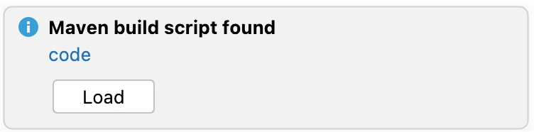

# DD Poker Developer Notes

## Introduction

Welcome to the DD Poker source code. This page tells you (hopefully)
everything you need to know to run the three main programs that
make up DD Poker:

* **DD Poker Game** — the poker game itself, a Java Swing desktop application
* **Poker Server** — the backend API server that the game talks to for online games
* **Poker Web** — the old Apache Wicket-based DD Poker website, including the "Online Game Portal", which
  shows various information about online games like current games, history, games by player, etc.

Development happens on **Mac, Linux, or Windows via WSL2** — all three are the same Unix
environment as far as this repo is concerned, so there is one set of instructions below.

The **Poker Server** and **Poker Web** portal are developed on that Unix environment only.
They lean on shell scripts, MySQL setup scripts and a local SMTP server, none of which are
worth porting for the handful of people who would use them.

Windows developers should use [WSL2](#windows-via-wsl2).  Running the build natively on
Windows (PowerShell, no WSL) is possible and is covered in
[Appendix I](#appendix-i-native-windows-and-powershell), but it covers the **desktop game
only** and is a secondary path used mainly for testing how the game behaves for Windows
players — not a fully supported development environment.

## Prerequisites

Required software:

* Java 25 - [See Adoptium](https://adoptium.net/temurin/releases/?os=any&package=jdk&version=25)
* Maven 3 - [See Apache Maven](https://maven.apache.org/install.html)
* Docker (optional, but useful to run some things) - [See Docker](https://docs.docker.com/engine/install/)

Both `java` and `mvn` must be on your `PATH`.

We provide the `ddpoker.rc` file, which sets some environment variables required by the scripts in
`tools/bin` and `tools/db`, adds these script directories to the `PATH`, creates some useful
`mvn` aliases (used below) and performs some sanity checks.

**NOTE**: all commands below assume you have sourced `ddpoker.rc`, have `mvn` and `java` installed and are
in the root of the `ddpoker` repository.

```shell
source ddpoker.rc
```

## Platform Setup

### Mac

[Brew](https://brew.sh/) is useful to install Java and Maven:

```shell
brew install temurin@25 maven
```

### Linux (Ubuntu/Debian)

Ubuntu's own repositories lag behind on JDK versions, so install Java 25 from the
[Adoptium apt repository](https://adoptium.net/installation/linux/):

```shell
sudo apt install -y wget apt-transport-https gpg

wget -qO - https://packages.adoptium.net/artifactory/api/gpg/key/public \
  | gpg --dearmor | sudo tee /usr/share/keyrings/adoptium.gpg > /dev/null

echo "deb [signed-by=/usr/share/keyrings/adoptium.gpg] https://packages.adoptium.net/artifactory/deb \
$(awk -F= '/^VERSION_CODENAME/{print$2}' /etc/os-release) main" \
  | sudo tee /etc/apt/sources.list.d/adoptium.list

sudo apt update
sudo apt install -y temurin-25-jdk maven
```

The `JAVA_HOME` auto-detection in `ddpoker.rc` is Mac-only (it uses `/usr/libexec/java_home`),
but the apt package above puts Java 25 on your `PATH`, and sourcing `ddpoker.rc` will confirm
the version for you.

For Docker on Linux, either Docker Desktop or just the Docker Engine will do.

### Windows via WSL2

[WSL2](https://learn.microsoft.com/en-us/windows/wsl/install) runs a real Ubuntu on your
Windows machine, which makes Windows development identical to Linux development — same
shell, same scripts, same commands as the rest of this document.  Modern WSL includes
**WSLg**, so DD Poker opens as an ordinary window on your Windows desktop with no X
server to configure (unlike the Docker approach in _Appendix D_).

From PowerShell, install WSL and Ubuntu:

```powershell
wsl --install -d Ubuntu
```

Reboot if prompted, then open the Ubuntu terminal and follow the
[Linux (Ubuntu/Debian)](#linux-ubuntudebian) instructions above to install Java and Maven.

Two Windows-side details:

* Install [Docker Desktop](https://www.docker.com/products/docker-desktop/) on **Windows**,
  not inside WSL.  Then, in **Settings → Resources → WSL Integration**, enable integration
  for your Ubuntu distro so the `docker` command works inside WSL.  This is what lets the
  MySQL container in _Appendix A_ work from WSL.
* **Clone the repo into the WSL filesystem** (e.g. `~/work/ddpoker`), not under `/mnt/c`.
  Reaching the Windows drive from WSL goes over a slow filesystem bridge — in the sister
  DD Photos repo, the same warm build took **64s** from `/mnt/c` versus **2.4s** from
  `~/work`.  Windows tools can still reach the WSL copy via
  `\\wsl$\Ubuntu\home\<user>\work` if needed.

Verify WSLg is working with `echo $DISPLAY` (it should print something like `:0`).

## Compile Code

To compile the code and create the `.jar` and `.war` files,
use maven.  This version skips the tests, which you can
run separately (see below).

```shell
mvn-package-notests
```

After you have run this, any of the scripts discussed below should just work.

The build compiles with `-Xlint:deprecation,removal` (see `maven-compiler-plugin` in
`code/pom.xml`), so any use of a deprecated JDK API is reported with its file and line
number.  The tree is currently free of them — please keep it that way rather than letting
the warnings pile up again.  Warnings do not fail the build, since a dependency bump can
introduce one that has nothing to do with the change being made.

## Poker Game

To run the desktop poker game, either run `PokerMain` in IntelliJ or use the script:

```shell
poker
```

If you want to run the game using your personal servers, you'll need to set go
to _Options → Online → Public Online Servers_ and check the **Enabled** checkbox and
enter the server information in the two fields.  See below for details on running the
servers.

If you start `poker` with `enabled=true`, but your servers are not running, you may see a
several-second delay on startup as a connection attempt is made and freezes the UI until it times out.

## Development

IntelliJ can be used to run the programs described below.  If you open up the
root of this project in IntelliJ, it should auto-detect
the `code/pom.xml` file and prompt you to load it:



**NOTE**: You will probably need to edit the Project Structure to tell IntelliJ to use Java 25.
Go to _File → Project Structure... → Project Settings → Project → SDK_ and
set to Java 25 (you may need to add it (_+ Add SDK_) as a new SDK if not already there).

On Windows, use IntelliJ's
[WSL support](https://www.jetbrains.com/help/idea/how-to-use-wsl-development-environment-in-product.html)
to open the checkout living inside WSL (`\\wsl$\Ubuntu\...`).

## Server Dependencies

To run server code, you need to have MySql running and an SMTP server.  See the
appendices below for more details:

* `Appendix A` Setup Database via Docker
* `Appendix B` Setup Email SMTP server on Mac
* `Appendix C` Setup Database directly on a Mac

The server-side setup assumes a Unix shell — Mac, Linux, or WSL2.  See
[Appendix I](#appendix-i-native-windows-and-powershell) for what native Windows does and
does not cover.

## Run Tests

To build code and run unit tests, use `mvn-test`.  Some
tests assume the `pokertest` database exists.

```shell
mvn-test
```

## Poker Server

To run the DD Poker server and chat server, which is what the game talks to,
you can run `PokerServerMain` in IntelliJ or use the `pokerserver` script:

```shell
pokerserver
```

## Poker Website

To run the DD Poker website, a wicket-based app, you have two options:

The first option is to run the `PokerJetty` testing app, which
runs the webapp using Jetty.  This setup allows one to
auto-detect changes to Wicket `.html` files, so you don't
have to restart after each edit.  You can run `PokerJetty`
directly in IntelliJ, or via the `pokerweb` script:

```shell
pokerweb
```

The second option is to run using Tomcat via Docker, similar to
what a production setup might look like.

```shell
mvn-package-no-tests
docker build -f Dockerfile.pokerweb.docker -t pokerweb .
docker run -it --rm -p 8080:8080 pokerweb

# get container id for following commands
CONTAINER=$(docker ps | grep pokerweb | cut -f 1 -d " ")

# To see logs
docker exec -it $CONTAINER tail -200f /home/ddpoker3/work/ddpoker/runtime/log/poker-web.log

# To login to running server
docker exec -it $CONTAINER bash
```

Once started, you can visit [http://localhost:8080/online](http://localhost:8080/online).

## Code Notes

This section is meant to help developers understand the code base, and it contains random
bits of knowledge and advice.

### Warning — This Code is Old!

This code base was originally written over 20 years ago, beginning in 2002.  The majority
of DD Poker was written from 2004 to 2007, with sporadic updates after that.  The original
JDK was 1.5 (aka Java 5).

Amazingly, nearly all of our dependencies (Swing, Hibernate, Wicket, Jetty, Tomcat, log4j, etc.) have been updated 
to the latest versions that work with Java 25.  The only exception is `HSQLDB`, which we currently
have at 1.8.0.10. The latest is 2.7.4, but this requires updating existing databases, which
we don't want to deal with at this time.

### Modules

Here is a brief overview of the modules in this repo, in the order maven builds them, which
means the later modules are dependent on one or more of the earlier modules.

* `common` - core functionality including configuration, logging, XML, properties, various utils
* `mail` - email sending tools
* `gui` - GUI infrastructure extending Java Swing
* `installer` - custom installer logic (e.g., cleanup)
* `db` - database infrastructure extending Hibernate
* `wicket` - web infrastructure extending Apache Wicket (currently on [Wicket 10](https://nightlies.apache.org/wicket/guide/10.x/single.html))
* `jsp` - tools using `.jsp` pages to generate emails and files
* `server` - core server functionality
* `udp` - core UDP networking functionality
* `gamecommon` - core game utilities shared across client and server
* `gameengine` - core game engine
* `ddpoker` - a few classes put into `com.ddpoker` package instead of `com.donohoedigital` (for reasons lost to history)
* `pokerengine` - core poker utilities shared across client and server
* `pokernetwork` - core poker networking infrastructure shared across client and server
* `poker` - DD Poker UI (aka client)
* `tools` - misc tools used for running a games business
* `gameserver` - core game server
* `pokerserver`- DD Poker backend server
* `gametools` - tools to help build games (e.g., Border and Territory mangers)
* `pokerwicket` - DD Poker website and Online Portal
* `proto` - prototype code used for experiments and proof of concept code

### Unit Tests (a note from Doug)

There is some test coverage, but it is sorely lacking in the core poker logic.  This actually
bit me once when I had to solve a multiple-split pots bug.  I didn't get religion
on good test coverage until I worked at a high-frequency trading company writing code
to trade on the US stock markets with my boss's money.

I apologize for the lack of tests.

### Properties Files

Properties files are used for two primary purposes

* `log4j2.*.properties` - `LoggingConfig` - configure logging
* `*.properties` - `PropertyConfig` - configure application behavior, various settings, localizable text

One key tenet we adhered to at Donohoe Digital was to avoid making "temporary" changes
to `.properties` files for personal use (e.g., development, debugging or testing).
Instead, settings could be overridden using user-specific files.  These could be
checked into the tree and not impact production code.  This is why you see properties
files with `donohoe` in the name.

Here's roughly how the two versions work:

#### LoggingConfig (log4j)

Based on "application type", our config looks for:

* Client - `log4j2.client.properties`
* Webapp - `log4j2.webapp.properties`
* Server - `log4j2.server.properties`
* Command Line + Unit Tests - `log4j2.cmdline.properties`

It looks for and loads these files on the classpath in this order:

* `config/common/log4j2.[apptype].properties` - default settings for `apptype`
* `config/[appname]/log4j2.[apptype].properties` - override default settings for application named `appname`
* `config/override/[username].log4j2.properties` - overrides all types for `username`
* `config/override/[username].log4j2.[apptype].properties` - overrides for just `apptype` for `username`

The latter files override any settings in the earlier files.  In log4j, this is commonly used
to turn on logging to the console or to change the logging level for a particular library.

#### PropertyConfig

Similar to logging config, each `apptype` has its own properties file, which are loaded in this order:

* `config/[appname]/common.properties` - properties for application named `appname`, shared across all types
* `config/[appname]/[apptype].properties.[locale]` - properties for `apptype` for `appname` for given locale
* `config/[appname]/[apptype].properties` - properties for `apptype` for `appname` (if no locale provided)
* `config/[appname]/override/[username].properties` - overrides for `appname` for `username`

The user-specific overrides were commonly used to enable debug/testing settings and to change the IP of the
backend server to something running locally.

There aren't any locale-specific settings, but it was successfully used in the past to localize a game into
another language.

### Debug Settings

There are lots of `settings.debug.*` entries in the code which are used to make
development easier.  Typically, you put these in your `[username].properties` file,
so they only are used by you.

Here are a few interesting ones

```properties
# Enable debug flags
settings.debug.enabled=true

# In game, draw border around areas that Swing is repainting
settings.debug.repaint=true

# Human player makes decisions for AI players in game (useful for
# creating various scenarios, like all players go all-in)
settings.debug.dougcontrolsai=true

# Print info about each pot
settings.debug.pots=true

# On server, when sending online profile email, always send to this address,
# Which is useful for testing registrations with other emails
settings.debug.profile.email.override=true
settings.debug.profile.email.override.to=my-email@my-domain.com
```

There are many other examples, just take a look in the code for `settings.debug` to
find the constants and then find usages of those constants.

### Installers

The installers in [Releases](https://github.com/dougdonohoe/ddpoker/releases) are built with
`install4j` — see [Appendix H](#appendix-h-releasing-a-new-version) for the release process.

An alternative to using those installers
is to distribute an all-in-one `.jar` file by doing this:

```shell
mvn-install-notests
cd code/poker
mvn package assembly:single -DskipTests=true
```

This creates a `poker-3.0-jar-with-dependencies.jar` in the `target` directory.  You can then
distribute this `.jar` file and run it like so:

```shell
java -jar target/poker-3.0-jar-with-dependencies.jar

# Test it from code/poker
java -jar poker-3.0-jar-with-dependencies.jar
```

For Mac users, if you also distribute the `installer/install4j/custom/ddpokericon.icns` file,
you can get a dock icon:

```shell
java -Xdock:icon=ddpokericon.icns -jar poker-3.0-jar-with-dependencies.jar

# Test it from code/poker
java -Xdock:icon=../../installer/install4j/custom/ddpokericon.icns -jar target/poker-3.0-jar-with-dependencies.jar
```

### Questionable Features

When a player registers a profile for online play, the server sends an email with a password
as a way to confirm the email is correct.  While the player can change this password after the
fact, it isn't forced.  Worse, we store the password in the database (encrypted), but can
decrypt it programmatically, which we use for the "I forgot my password" functionality (we
email the user their current password!).  I have no idea why we went down this path, but
it was just a game after all, and this probably reduced our support costs.

Yes, this is embarrassing in retrospect.

### Computer AI

While not "AI" by today's standards, there is a white paper in `docs/AI_Whitepaper.rtf` that
explains the design of DD Poker's computer opponents.

### Database Host

Back when this code was originally written and deployed, the code ran on the same machine
as the database, so using the MySQL host of `localhost` or `127.0.0.1` was sufficient.  To allow
use from within Docker, we needed more flexibility here, so I added use of the `DB_HOST` environment
variable. The use of `host.docker.internal` in the `Dockerfile.pokerweb.docker` is likely Mac-specific.

### Game Engine Tools

This codebase includes an underlying game engine, which was originally used to
build a computer version of the board game, War! Age of Imperialism.  One of the needs there was
to draw all the "territories" on a world map as well as identify where to place things like
playing pieces and labels.  DD Poker uses this same game engine, where territories are the
playing seats and pieces are things like the cards and chips.  There are two tools used
to trace the borders and mark the territory locations:

```shell
territorymgr -module poker
bordermgr -module poker
```

These edited the corresponding `gameboard.xml` and `border*.xml`  files, but remembering
the keyboard shortcuts and how to save requires looking at the
code (`GameboardTerritoryManager`, `GameboardBorderManager` and base `GameManager`).

### Preferences

Preferences set in the game are saved using the Java Preferences API, under the
`com/donohoedigital/poker3` node (see `Prefs.getUserRootPrefs()`).  Where that actually
lives is up to the JDK and differs per platform:

| Platform    | Location                                                                       |
|-------------|--------------------------------------------------------------------------------|
| Mac         | `~/Library/Preferences/com.donohoedigital.poker3.plist`                        |
| Linux / WSL | `~/.java/.userPrefs/com/donohoedigital/poker3/` (a tree of `prefs.xml` files)  |
| Windows     | Registry key `HKCU\Software\JavaSoft\Prefs\com\donohoedigital\poker3`          |

Default values for items in the Options dialog are set in
`code/poker/src/main/resources/config/poker/client.properties`, and actual values
set by the user are stored in the platform location above.

To view the current contents:

```shell
# Mac
plutil -convert xml1 ~/Library/Preferences/com.donohoedigital.poker3.plist -o -

# Linux / WSL
cat ~/.java/.userPrefs/com/donohoedigital/poker3/prefs.xml
```

```powershell
# Windows
Get-ChildItem -Recurse 'HKCU:\Software\JavaSoft\Prefs\com\donohoedigital\poker3'
```

Note that on Linux and Windows the node names are escaped by the JDK (mixed-case names get
encoded), so some of the directory and key names look like line noise.  That is expected.

To clear all preferences:

```shell
# Mac - must also restart cfprefsd, which caches preferences in memory
cd ~/Library/Preferences
rm -f com.donohoedigital.poker3.plist
killall -u $USER cfprefsd

# Linux / WSL
rm -rf ~/.java/.userPrefs/com/donohoedigital/poker3
```

```powershell
# Windows
Remove-Item -Recurse 'HKCU:\Software\JavaSoft\Prefs\com\donohoedigital\poker3'
```

### Classpath and Dependency Tree

We override the `mvn dependency:tree` to create `target/classpath.txt` in each module, which
is used by the `runjava` and `buildall.pl` scripts to determine the jar files needed to
run a program.

To get the default tree output, to diagnose dependency issues, run this in `code` or in a particular
module, like `code/wicket`.

```shell
# Need to "install" to get proper trees when doing it in sub-tree (for reasons I'm not clear on)
mvn-install-no-tests

# cd to a module
cd code/pokerwicket

# output to console, with other maven INFO
mvn dependency:tree -Ddependency.classpath.outputFile=

# just the tree
mvn dependency:tree -q -Dscope=runtime -Ddependency.classpath.outputFile=/tmp/t && cat /tmp/t && rm -f /tmp/t

# ddpoker.rc has alias for this previous one
mvn-tree
```

## Appendix A — Database via Docker

DD Poker's server uses MySQL.  You can easily run an instance locally using Docker.

```shell
# Create and run in background.  Data is persisted across restarts
docker run --name my-mysql -e MYSQL_ROOT_PASSWORD='d@t@b@s3' \
  -d -p 3306:3306 -v mysql_data:/var/lib/mysql mysql:latest
 
# Start/Stop
docker stop my-mysql
docker start my-mysql
 
# Remove
docker stop my-mysql && docker rm my-mysql && docker volume rm mysql_data
 
# Poke around on instance
docker exec -it my-mysql bash

# Test database access
export MYSQL_PWD='d@t@b@s3'
mysql -h 127.0.0.1 -u root
```

You can also run MySQL directly on your machine. See _Appendix C_ below for Mac instructions.

Once you have it running you need to create the `pokertest` and `poker` databases which are used
for unit tests and the backend servers respectively.

```shell
reset_dbs.sh poker
reset_dbs.sh pokertest
```

The password for these local databases is `p0k3rdb!`. You can connect to them directly:

```shell
mysql -h 127.0.0.1 -D poker -u poker -pp0k3rdb!
mysql -h 127.0.0.1 -D pokertest -u pokertest -pp0k3rdb!
```

**NOTE 1**: I've seen an issue where the DD Poker tests or servers cannot connect to MySQL
until at least one command line connection has been made first.  I haven't spent time trying
to figure out why this is (could be a weird Docker issue).  After restarting MySQL, run the
two commands above to verify things are working properly.

**NOTE 2**: Yes, it is bad practice to store database passwords in `git`, but keep the database
and servers all used to run on the same machine and in production, the MySQL installation only
allowed access from localhost, so it wasn't a huge risk.  For development purposes, this
is also fine.

## Appendix B - Email

DD Poker's backend server and website are configured to send emails during
the Online Profile setup process (a password is emailed to the user).  It is
also used in response to registering the game and "I forgot my password"
functionality.

The "from" email addresses are set in `poker/server.properties`.  If you run the server,
you ought to use a different email than these.

```shell
settings.server.profilefrom= no-reply@ddpoker.com
settings.server.regfrom=     no-reply@ddpoker.com
```

To enable the `postfix` SMTP mail server on a Mac:

```shell
# turn on
sudo postfix start

# turn off
sudo postfix stop

# status
sudo postfix status

# test (may go to spam), will generate a response report
echo "Test email body" | sendmail -v your_email@your_domain.com
 
# to view response reports, use cmd line 'mail' tool
mail
1 # to view msg
d # to delete
q # to quit
```

**NOTE**: Emails sent this way typically go to spam because they are coming from a random machine,
so check your spam folder and mark as "not spam".

## Appendix C: Database via Mac MySQL Install

To run MySQL directly on your Mac instead of via Docker:

```shell
# Install MySQL
brew install mysql

# Start MySQL immediately and enable auto-start on boot
brew services start mysql

# To undo auto-start configuration and stop the service
brew services stop mysql

# To connect to the MySQL server
mysql -u root
```

Set the root password expected by our scripts:

```shell
# Connect to MySQL as the root user
mysql -u root

# Set or change the root password
ALTER USER 'root'@'localhost' IDENTIFIED BY 'd@t@b@s3';
quit
```

Test new password:

```shell
# Test database access using host IP and new password
export MYSQL_PWD='d@t@b@s3'
mysql -h 127.0.0.1 -u root
```

Follow the instructions above to create the database tables (via `reset_db.sh`).

## Appendix D: Testing on Ubuntu via Docker

**NOTE**: this is for running Linux from a Mac.  If you are on Windows via
[WSL2](#windows-via-wsl2), you already have a real Ubuntu with WSLg handling the display,
so none of this is necessary.

It is possible to run DD Poker in Ubuntu in Docker and display it on your Mac, but
it can be a little finicky.  Here's what I got to work with help from
[this helpful gist](https://gist.github.com/cschiewek/246a244ba23da8b9f0e7b11a68bf3285).

First Install XQuartz from [www.xquartz.org](https://www.xquartz.org/) and then launch it from `Applications` or
from the command line:

```shell
open -a XQuartz
```

Next, got to _XQuartz → Settings → Security_ and ensure **Allow connections
from network clients** is checked.


Then logout and log back in to ensure these settings are in effect (a reboot
may also be necessary).

Next, follow these steps:

```shell
# Start XQuartz again
open -a XQuartz

# Tell X to allow connections
xhost + localhost

# Build docker image
docker build -f Dockerfile.ubuntu.docker -t pokerubuntu .

# Run it, mapping ddpoker dir and maven .m2-ubuntu dir to the image
docker run -it --rm -v $(pwd):$(pwd) -v $HOME/.m2-ubuntu:/root/.m2 \
  -w $(pwd) -e DISPLAY=host.docker.internal:0 pokerubuntu
```

You can test X is working by running `xeyes`.  It should display the iconic X app that
follows your cursor with big oval eyes.  If you encounter problems, the gist mentioned above
has good troubleshooting tips.

Next, you should be able to build and run poker from the Ubuntu container:

```shell
source ddpoker.rc
mvn-package-notests
poker
```

## Appendix E: Running GitHub Actions Locally

You can run GitHub actions locally using the [`act`](https://nektosact.com/) tool (which requires Docker).

To install `act`:

```shell
# Mac
brew install act

# Linux / WSL - there is no apt package
curl --proto '=https' --tlsv1.2 -sSf https://raw.githubusercontent.com/nektos/act/master/install.sh \
  | sudo bash -s -- -b /usr/local/bin
```

The `act-ddpoker` alias uses a custom Docker image you need to build once:

```shell
docker build -t ddpoker-act-runner -f Dockerfile.act .
```

To run the GitHub testing action locally, just use the alias:

```shell
act-ddpoker
```

**NOTE**: This will fail if MySQL is already running, since it will prevent `act` from starting MySQL.  You'll
see an error like this:

```
[DD Poker CI/test] failed to start container: Error response from daemon: 
failed to set up container networking: driver failed programming 
external connectivity on endpoint act-DD-Poker-CI-test
Bind for 0.0.0.0:3306 failed: port is already allocated
```

## Appendix F: Testing Notes

When testing major changes, here's a checklist of things to manually
verify:

* Start MySQL (either in Docker or locally), then connect via `mysql`
  * `mysql -h 127.0.0.1 -D poker -u poker -pp0k3rdb!`
  * `mysql -h 127.0.0.1 -D pokertest -u pokertest -pp0k3rdb!`
* `mvn-package`
* Start server via `PokerServerMain` and `pokerserver`
* Start website via `PokerJetty` and `pokerweb`
* Build website Docker image and run via Docker
* Start game via `PokerMain` and `poker`
* With the server running
  * verify game can start an online game (adjust online settings using server's IP)
  * verify global *Online Lobby*
* Start game from Ubuntu Docker
* Build and start the game natively on Windows via `.\mvn` (see
  [Appendix I](#appendix-i-native-windows-and-powershell))
* Build `act` docker image and running `act-ddpoker` (remember to stop MySQL)

## Appendix G: DD Poker Website

Back in the day, the Wicket-based webapp (aka the Online Portal) was also the 
source of `ddpoker.com`.  This site was replaced with a simple static memorial page in
July 2017. In November 2025, we modernized the website, made it responsive (aka mobile-friendly),
and republished as a means to document DD Poker features and functionality.

The `generate-website` script is used to extract this static version
of the website without interactive features like the Online Portal and Admin.
This is now used as the source of [ddpoker.com](https://www.ddpoker.com/).

The debug setting `settings.debug.docmode=true` must be on before starting `PokerJetty`
or running `pokerweb`.  The `generate-website` script assumes `node` is installed and 
available on the `PATH`.  The script saves all JavaScript, CSS, HTML and images to the
current working directory.  To preview the site run:

```bash
python3 -m http.server 8000
```


## Appendix H: Releasing a New Version

### Prep

* Add the new version to the top of the `VERSION` history in
  `code/pokerengine/src/main/java/com/donohoedigital/games/poker/engine/PokerConstants.java`
  (most recent first - nothing needs commenting out).
* Add a matching entry at the top of
  `code/poker/src/main/resources/config/poker/help/whatsnew.html`.  The release notes
  are generated from this entry, so the version in its header must match the new version
  exactly.
* Commit everything, since the GitHub release tags the code.
* Plug in the code signing USB token.
* Have KeePassXC ready for the signing passwords.

### Build and release

```shell
# Build everything to ~/builds/poker3.x/full/ddpoker/installer/builds
buildall -full -clean

# Inspect / validate the installers if desired

# Rehearse the release: drafts the notes, echoes the gh command, changes nothing
buildall -full -github-dryrun

# Release to GitHub
buildall -full -github
```

`-full` builds in a **separate clone** at `~/builds/poker3.x/full/ddpoker`, not this
working tree.  `-github` skips the git, mvn, unpack, buildrelease and installer steps,
assuming a `-full` run already produced and validated the installers.

### What `-github` does

1. Checks the build clone isn't behind `origin/main` and that all three installers exist,
   failing before anything is published.  Since `-github` skips the git step, a stale clone
   means both a bad README push and installers built from old code - re-run `-full` if it
   complains.
2. Generates release notes from the `whatsnew.html` entry for this version into
   `installer/builds/release_notes_<version>.md`, converting each `<li>` to a Markdown
   bullet (`<tt>` becomes code, `<b>` becomes bold), then appending a **Full Changelog**
   compare link against the previous release and the `md5sums.txt` block.
3. Prints the drafted notes and waits for approval before running `gh release create`.
4. Rewrites the installer links in `README.md` between the
   `<!-- installers:begin ... -->` / `<!-- installers:end -->` markers, shows the diff,
   and asks before committing and pushing.
5. Runs `git pull --tags` in the directory you launched `buildall` from, so this working
   tree picks up the new tag and the README commit that were made in the build clone.
   That last step is skipped, with a note saying why, if you didn't run from a git repo,
   if that repo isn't on `main`, or if you ran from the build clone itself (`-dev`).  A
   failure there is only a warning - the release is already published at that point, so a
   dirty working tree won't be reported as a broken build.

**Do not hand-edit the marked block in `README.md`** - anything inside those markers is
regenerated.  Put wording you want kept outside them.

### Developing the installer locally

* `install4j` has a UI for editing `installer/install4j/poker.install4j`; under _Build_
  you can selectively choose which media files to build.
* Use `buildall -dev` to build into this working tree instead of the build clone.
* The `-nogit`, `-nomvn`, `-nounpack`, `-nobuildrelease`, `-noinstaller` and `-nonotarize`
  options skip individual steps, which saves a lot of time when iterating.  Run `buildall`
  with no arguments to list them all.
* Installer file names come from the `mediaFileName` attribute on each media set in
  `poker.install4j` and must stay in step with the `@PLATFORMS` table in `buildall.pl`.

## Appendix I: Native Windows and PowerShell

Everything above assumes a Unix shell — Mac, Linux, or Windows via
[WSL2](#windows-via-wsl2), which is the recommended way to develop on Windows.

This appendix covers building and running **natively on Windows**, from PowerShell, with no
WSL involved.  The reason to do this is to exercise the game the way Windows players
actually experience it — native file dialogs, DPI scaling, the registry-backed preferences.
It is a testing environment, not a fully supported development one.

Scope is the **desktop game only**.  The Poker Server and the Wicket-based Poker Web portal
are not supported here; see [Known gaps](#known-gaps) at the end.

### Setup

Install the JDK by downloading the **Temurin 25 `.msi`** from
[adoptium.net](https://adoptium.net/temurin/releases/?version=25) and running it — accept
the defaults, and let it set `JAVA_HOME` and update your `PATH`.  If you prefer the command
line, `winget` installs the same package:

```powershell
winget install EclipseAdoptium.Temurin.25.JDK
```

Note that a bare `winget install java` does *not* get you a JDK 25 — the package ID above is
what pins the version.

**Maven does not need to be installed.**  There is no `winget` package for Apache Maven, so
this repo ships the [Maven Wrapper](https://maven.apache.org/wrapper/) as `mvn.cmd` in the
repo root.  Invoke it as `.\mvn` and it behaves like a normal `mvn`, downloading a
known-good Maven on first use and caching it under `~/.m2/wrapper`.  (Mac and Linux
developers install Maven normally and ignore this file.)

[Git for Windows](https://git-scm.com/download/win) is optional.  You do not need it to
build or run the game, but it gives you a Git Bash shell if you want to run any of the
`tools/bin` scripts.

Clone the repo onto your Windows drive, e.g. `C:\Users\<user>\work\ddpoker`.

> **Use a separate clone from your WSL one.**  Each build writes platform-specific paths
> into `code/*/target/classpath.txt`, so building in one environment leaves the other's
> `tools/bin` scripts broken until you rebuild.

### Build and run

```powershell
# build, skipping tests
.\mvn -f code/pom.xml package -DskipTests=true

# install the modules into your local Maven repository
.\mvn -f code/pom.xml install -DskipTests=true

# launch DD Poker
.\mvn -f code/pom.xml -pl poker exec:exec
```

The `exec:exec` goal is configured in `code/poker/pom.xml` and launches
`com.donohoedigital.games.poker.PokerMain` with the same JVM options the `poker` script
uses, less the Mac-only dock icon.  Forward slashes in `-f code/pom.xml` are fine — PowerShell passes the argument
through untouched, and both Windows and Java accept `/` in paths.

A couple of notes:

* `exec:exec` does not compile anything.  It runs `poker` from `code/poker/target/classes`
  but picks up every other module as a jar from your local Maven repository, which is why
  the `install` above is a separate step.  After editing `poker` you need a `package`
  first, and after editing any other module you need to re-run the `install`.
* The `install` builds all 21 modules.  You could narrow it with `-pl`, but `poker` pulls in
  `gameengine`, `pokernetwork` and `db` plus their transitive dependencies, so the list is
  long and easy to get out of step — a full install is simpler.

### PowerShell quirks worth knowing

* **Quote `-D` arguments containing dots.**  PowerShell splits an unquoted
  `-Dskip.unit.tests=false` at the first `.`, handing Maven a stray `.unit.tests=false` and
  failing with *"Unknown lifecycle phase"*.  Quote it:

  ```powershell
  .\mvn -f code/pom.xml test '-Dskip.unit.tests=false'
  ```

  `-DskipTests=true` has no dot, so it is fine unquoted.
* `./mvn` also works in PowerShell — `PATHEXT` contains `.CMD`, so the extensionless name
  resolves to `mvn.cmd`.  The old `cmd.exe` prompt is the exception: it rejects `./` with
  *"'.' is not recognized as an internal or external command"*, so use `.\mvn` there.
* The `ddpoker.rc` aliases and the `tools/bin` scripts (`poker`, `runjava`, `pokerserver`,
  `pokerweb`, `buildall`) are Bash, so they do not work in PowerShell.  Run them from Git
  Bash if you need them — `runjava` already handles the Windows classpath separator.

### Known gaps

* **The Poker Server and Poker Web portal are not run natively.**  This is deliberate — they
  assume a Unix shell, the MySQL setup scripts and a local SMTP server.  Use WSL2, Mac or
  Linux for server work.
* **Database provisioning is Unix-side.**  `tools/db/reset_dbs.sh` and its siblings are Bash
  and expect a `mysql` client on the `PATH`, so creating the `pokertest` database natively
  is not covered here yet.  The *test code itself is platform-neutral* — point a native
  Windows build at a reachable `pokertest` database and the whole suite runs; nothing is
  skipped on Windows.
* Building installers and running GitHub Actions locally are not exercised here; see
  [Appendix E](#appendix-e-running-github-actions-locally) and
  [Appendix H](#appendix-h-releasing-a-new-version), both of which assume a Unix shell.
